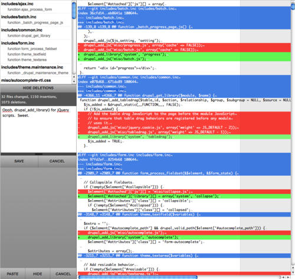

For those of you who don’t know, [Dreditor](https://drupal.org/project/dreditor) is a kick-ass [Greasemonkey script](https://addons.mozilla.org/en-US/firefox/addon/greasemonkey) that [Daniel Kudwien](http://www.unleashedmind.com) wrote to help make the process of reviewing patches more efficient.

It begins by adding a “review” link right next to the link for the patch file that looks like this:

When you click it, Dreditor opens the patch in an overlay that allows you to browse the affected files. It also allows you to select any line(s) you want to comment on and provides a `textarea` for you to enter them. You can do this for as many lines as you want. When you’re done, it allows you to paste fully formatted comments right in the comment `textarea` of the issue. It’s incredibly helpful and one of those “must have” tools for anyone reviewing patches for Drupal.

However, I’m used to viewing patches in TextMate, which is very different looking from the default style Dreditor provides. I find TextMate’s style a lot easier to read, so I created a [Userstyle](https://userstyles.org) for it last year. Since then, there have been changes to the markup and new features added, and this weekend I finally got around to updating my [Userstyle](https://userstyles.org/styles/21102/dreditor-textmate-style-for-drupal). I also gave the sidebar a redesign and did some other tweaks. If you use TextMate, you might want to [check it out](https://userstyles.org/styles/21102/dreditor-textmate-style-for-drupal).

Here’s what it looks like:

