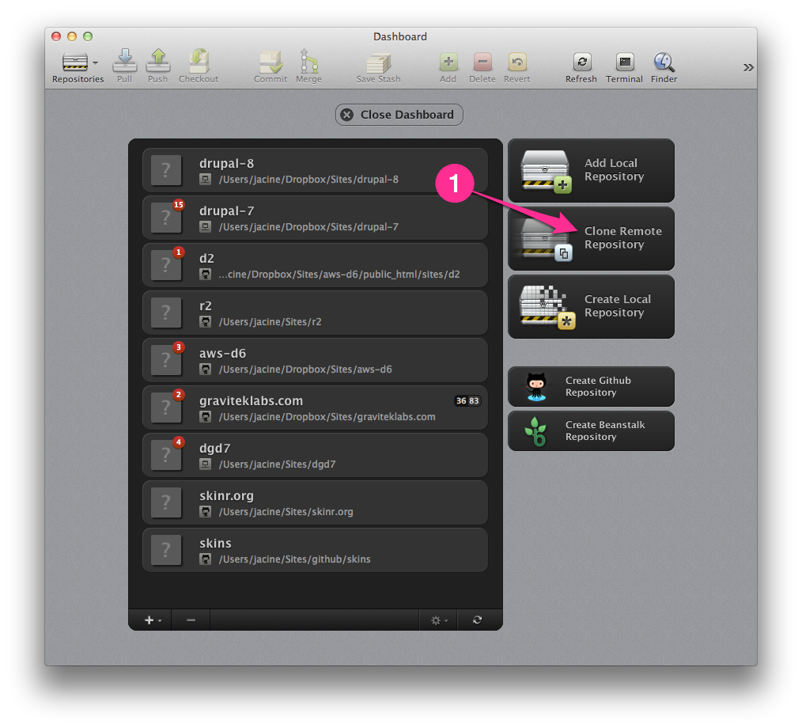
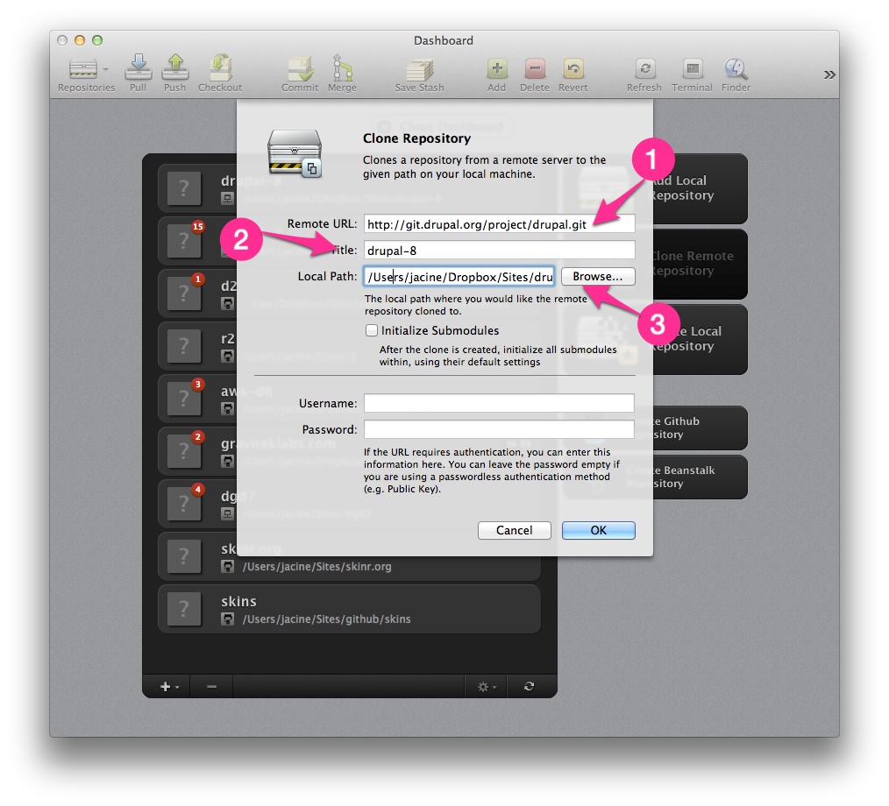
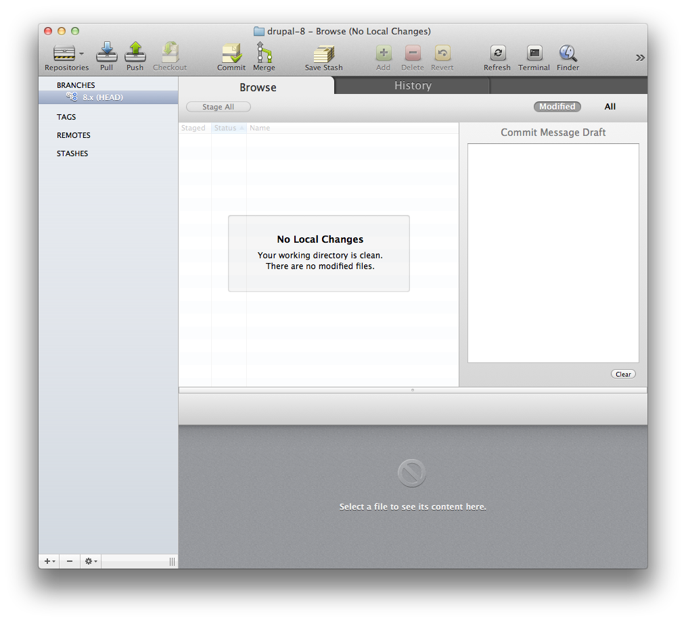
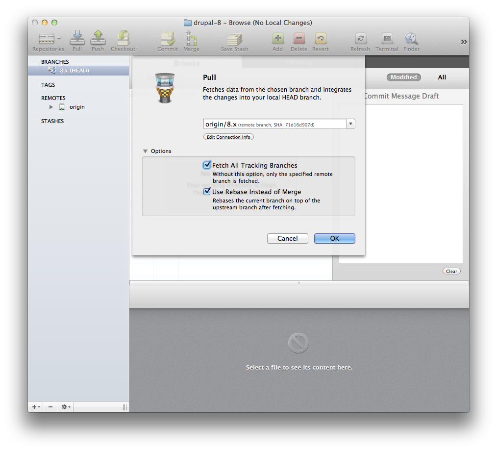
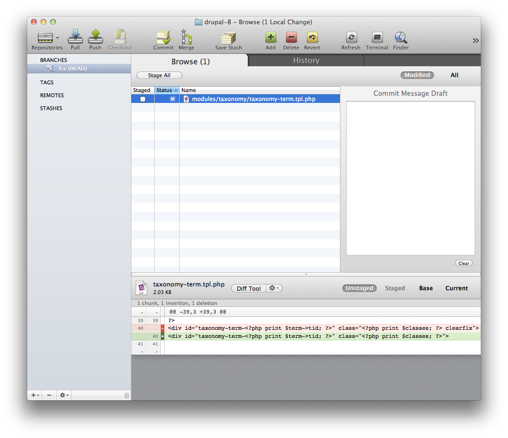
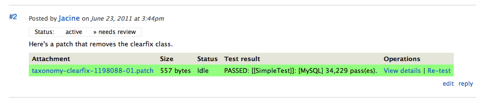
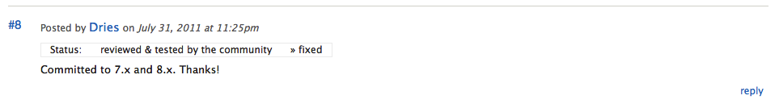

This guide will show you what patches are and how to work with them in the context of the Drupal project (though it will likely be useful for any project). When you’re finished reading, you’ll be able to create, apply and revert patches like a pro. Here’s what we’ll cover:

1. [The Anatomy of a Patch](#anatomy)
2. [Check out a project from the Git Repository](#git)
3. [How to Create a Patch](#create)
4. [How to Apply a Patch](#apply)
5. [How to Revert a Patch](#revert)

## <a name="anatomy"></a> The Anatomy of a Patch

A patch is a document that shows the differences between 2 versions of one or more files. We use them for Drupal development along with version control (Git) to communicate changes in a way that is very easy to understand, share and review. This is an example of a dead simple patch that changes a single line of code. If it looks a little complicated, not to worry. We’ll break it down bit by bit.

```diff
diff --git a/modules/taxonomy/taxonomy-term.tpl.php b/modules/taxonomy/taxonomy-term.tpl.php
index b515a9b..872d4cb 100644
--- a/modules/taxonomy/taxonomy-term.tpl.php
+++ b/modules/taxonomy/taxonomy-term.tpl.php
@@ -37,7 +37,7 @@
* @see template_process()
*/
?>
-<div id="taxonomy-term-<?php print $term->tid; ?>" class="<?php print $classes; ?> clearfix">
+<div id="taxonomy-term-<?php print $term->tid; ?>" class="<?php print $classes; ?>">
<?php if (!$page): ?>
<h2><a href="<?php print $term_url; ?>"><?php print $term_name; ?></a></h2>
```

### The Header

The header is automatically generated. It provides information about which files are affected and what command was used to generate it (in this case the `git diff`). The last two lines show the files being compared with a `---` (original) and `+++` (new) prefix.

```diff
diff --git a/modules/taxonomy/taxonomy-term.tpl.php b/modules/taxonomy/taxonomy-term.tpl.php
index b515a9b..872d4cb 100644
--- a/modules/taxonomy/taxonomy-term.tpl.php
+++ b/modules/taxonomy/taxonomy-term.tpl.php
```

### Hunks of Changes

The first line of each hunk range represents the starting line number and the number of lines in the hunk. As above, the `-` and `+` prefixes refer to the original and the new version of the file(s). Below this, each change is represented with the original version of it, followed by the new version of it. The original version is prefixed with minus sign. It represents code being removed in the patch. The plus sign represents the new version of code being added.

```diff
@@ -37,7 +37,7 @@
* @see template_process()
*/
?>
-<div id="taxonomy-term-<?php print $term->tid; ?>" class="<?php print $classes; ?> clearfix">
+<div id="taxonomy-term-<?php print $term->tid; ?>" class="<?php print $classes; ?>">
<?php if (!$page): ?>
<h2><a href="<?php print $term_url; ?>"><?php print $term_name; ?></a></h2>
```

## <a name="git"></a> Checking out a project from Drupal’s Git Repository with Tower

Before you can get started creating patches for Drupal projects, you’ll need to ensure you’ve got Git installed and that you’ve setup a local repository for the Drupal project you want to patch. You can test whether you’ve got Git installed by opening up terminal, typing “git” and hitting enter. If you get a bunch of help text, then you’re good. If you get a message saying the command isn’t found, then you’ll need to install Git.

```bash
-bash: git: command not found
```

If you are comfortable using the command line, [this page](https://git-scm.com/book/en/v2/Getting-Started-Installing-Git) will show you now to install Git. Afterwards, or if you’ve already got Git installed you can [skip to creating a patch](#create) instructions. If you need a little guidance with a GUI, read on.

### Set up a local repository with a GUI (Tower in this case)

Personally, I use and like [Tower](https://www.git-tower.com), so I’ll show you how to set up a repository using it. There are lots of Git <abbr title="Graphical User Interface">GUI</abbr>’s available and the process of setting up a new repository is pretty similar across them, so you’ll probably be able to follow along. Refer to the handbook for a growing list of [Git GUI apps](https://www.drupal.org/node/777182) that are available.


1. Begin by click “Clone Remote Repository” from the dashboard.

    

2. Grab the repository URL from from the [Version control](https://www.drupal.org/project/drupal/git-instructions) tab (available from every project page) as use it as the “Remote URL.” In this case we are setting up the current development version of Drupal core. Name the repository whatever you want and browse to a location where you want to place the files. Then click “OK.”

    

3. After clicking “OK” the clone process will begin. It usually takes a minute or two depending on your connection speed. When it’s complete a new repository will appear on your dashboard. When you click into it you’ll see that repository is already on the proper branch (8.x) and there are no local changes pending. That’s it.

    

## <a name="create"></a> How to Create a Patch

The first thing we need is an issue to patch. Last month, [mortendk](https://www.drupal.org/user/65676) noticed that an unwanted `.clearfix` class had somehow made it into the `taxnomy-term.tpl.php` template. Eventually, a new [bug report](https://www.drupal.org/node/1198088) against core was born. Morten didn’t know how to create a patch, but he tells us what should be done in the [first comment](https://www.drupal.org/node/1198088#comment-4644622). Unfortunately, if there is no actual patch, it will never reach “Reviewed and Tested by the Community” status and will not get fixed so that is just not enough. We need an actual patch. We know what the fix is here. We simply need to remove the “clearfix” class. So how do we do that?


1. ### Make sure the code is up to date

    Since we’ve already setup the repository, the first thing we need to do is make sure our codebase is completely up to date. There should be no other changes pending in the local repository. If you are using Tower or another GUI, you’ll need to make sure any pending changes are reverted before continuing.

    We can update the code in the Terminal with the following 2 commands:

    ```bash
    git reset --hard
    git pull origin 8.x
    ```

    In our GUI, we can click the “Pull” icon (in Tower it’s the second icon from the top left) to accomplish the same.

    

2. ### Make Your Changes and Save Them

    Since we’re working with version control, we can freely make changes and then save those changes right in place. They can always be easily reverted, and since none of us actually have commit access to Drupal core (or most contributed projects), we cannot actually do any harm. That being the case, I’m going to go straight to the affected file: `modules/taxonomy/taxonomy-term.tpl.php`. I’ve deleted the “clearfix” class and saved the file. Now when I look in Tower, it appears as “modified” and it’s got what looks like a patch underneath it.

    

3. ### <a name="generate-patch"></a> Create the Patch

    We are now ready to create our patch. Sorry folks, but we’re definitely going to have to use the command line for this one. Don’t worry - It’s 2 painless commands. I promise. First, we navigate to the root of the project and then we run the `git diff` command to generate the patch.

    ```bash
    cd ~/Sites/drupal-8
    git diff > patch-name.patch
    ```

    It gets more complicated when patches require adding, renaming and(or) removing files. In order to get these changes into a patch, Git needs to know about them. You cannot just `git add` or “stage” in Tower and then run the patch command. This will not work. Instead, you should stage the files like you normally would for a commit. After doing this, you can generate the patch using the `--staged` option when generating the patch. For more information, see [git diff documentation](https://www.kernel.org/pub/software/scm/git/docs/git-diff.html).

    ```bash
    git diff --staged > patch-name.patch
    ```

    This [short video](https://vimeo.com/28315653) shows this process in action.

    <iframe src="https://player.vimeo.com/video/28315653" width="640" height="456" frameborder="0" webkitallowfullscreen mozallowfullscreen allowfullscreen></iframe>

4. ### Upload the patch to Drupal.org

    You’re done! Your new patch is sitting in the root of the project directory. Now it’s time to upload it. It’s always best to explain what the patch does in the comment to help reviewers. This one is really simple and so is the comment. The patch is automatically tested by the testbot to ensure that it doesn’t cause any unwanted test failures elsewhere. Generally markup and CSS patches don’t have an affect on unit tests, so most of the time these will pass. The green background indicates that this one has passed the tests. Yay!

    

    If you [read on](https://www.drupal.org/node/1198088) in the issue, you’ll see that it is reviewed by and marked “reviewed and tested by the community” or what we like to call <abbr title="Reviewed and tested by the community">RTBC</abbr>. This gets the attention of core committers. Just a few comments and weeks later, Dries committed the fix to both Drupal 7 and Drupal 8. **SUCCESS!** Now that wasn’t so hard was it? This is how it happens, folks.

    

## <a name="apply"></a> How to Apply a Patch

The first step, as always, is [making sure your codebase is up to date](#create). Once your codebase is clean and ready to go, you are ready to apply a patch. I’ll use the [same issue](https://drupal.org/node/1198088) as an example.

1. The first thing we need to do is save [the patch](https://www.drupal.org/files/issues/taxonomy-clearfix-1198088-01.patch) to our project root. One fancy trick to speed this process up is to use [`wget`](http://www.gnu.org/software/wget/). This command doesn’t come with OS X by default, so if you want it you’ll need to [install it](http://krypted.com/mac-os-x/howto-install-wget-for-mac-os-x/). Of course this is not required. “Save as” works just as well, but if you do have it this is the simple command you’d run from the project root to download the patch:

    ```bash
    wget http://drupal.org/files/issues/taxonomy-clearfix-1198088-01.patch
    ```

2. Next we apply the patch using a simple command, again, from the root of the project:

    ```bash
    git apply -v taxonomy-clearfix-1198088-01.patch
    ```

    *Hint: You can start typing the first few letters of your patch name and use tab completion.*

    The `-v` flag stands for “verbose.” When using this, the command will provide feedback in Terminal showing how the patch has applied.

3. Once the patch has been applied you can begin testing it and making modifications to the code, if needed. You may easily create an updated version of the patch by repeating steps 3-4 in the [How to create a patch](#create) section.

## <a name="revert"></a> How to Revert a Patch

There are a few different ways to revert patches:

1. Revert changes for a specific file using a `-R` (revert) option:

    ```bash
    git apply -R taxonomy-clearfix-1198088-01.patch
    ```

2. Revert a specific file using git checkout, or you can select the file and click the “revert” icon in your GUI.

    ```bash
    git checkout modules/taxonomy/taxonomy-term.tpl.php
    ```

3. Reset the entire working tree with a hard reset:

    ```bash
    git reset --hard
    ```

## <a name="shortcuts"></a> Learn more

Here are some quick shortcuts to the documentation pages that detail everything you ever wanted to know about patches and more.

- [Git Documentation](https://www.drupal.org/documentation/git)
- [https://drupal.org/patch/create](https://www.drupal.org/patch/create)
- [https://drupal.org/patch/submit](https://drupal.org/patch/submit)
- [https://drupal.org/patch/apply](https://drupal.org/patch/apply)
- [https://drupal.org/patch/review](https://drupal.org/patch/review)
